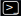

# AWS usage notes  

   

This repository contains AWS cloudshell (bash) code snippets for setting up a secure AWS environment. Code snippets are sourced from the [AWS Cookbook](https://github.com/awscookbook) or from [official AWS documentation](https://docs.aws.amazon.com/index.html).     

>**Note**  
> You will always be provided with a management console (i.e. GUI) or command line option for performing operations inside AWS. The command line interface, also called cloudshell, can be access at the top right panel via the  icon.  

# Step 1: Create AWS root user account   
When you create a free personal AWS account, you first create a [root user account](https://docs.aws.amazon.com/IAM/latest/UserGuide/id_root-user.html) which should only be used to:  
+ Create or delete an AWS account
+ Enable MFA on the AWS account root user 
+ Create or delete access keys for the root user 
+ Change the password for the root user
+ Secure the credentials for the root user
+ Transfer root user owner

The first three tasks to do are to: 
1. [Set up multi-factor authentication for your AWS account root user](https://docs.aws.amazon.com/IAM/latest/UserGuide/id_credentials_mfa_enable_virtual.html#enable-virt-mfa-for-root).  
2. [Delete or switch your root user access key to inactive](https://docs.aws.amazon.com/accounts/latest/reference/root-user-access-key.html), as you should not use your root user account for everyday AWS tasks. This can be controlled in the top right corner via `Root user account -> Security credentials -> Access management -> Access keys` in the AIM control panel or using `aws iam delete-access-key --access-key-id EXAMPLEACCESSID` in cloudshell.  
3. [Enable AWS billing alerts and create an AWS billing alarm](https://docs.aws.amazon.com/AmazonCloudWatch/latest/monitoring/monitor_estimated_charges_with_cloudwatch.html) using the AWS Billing console.    
4. Set your default region via `export AWS_REGION=ap-southeast-2` in cloudshell.  

# Step 2: Create multiple IAM user accounts via the root user account   

# Step 2: Creating a S3 bucket and assign IAM users with different S3 permissions  
 