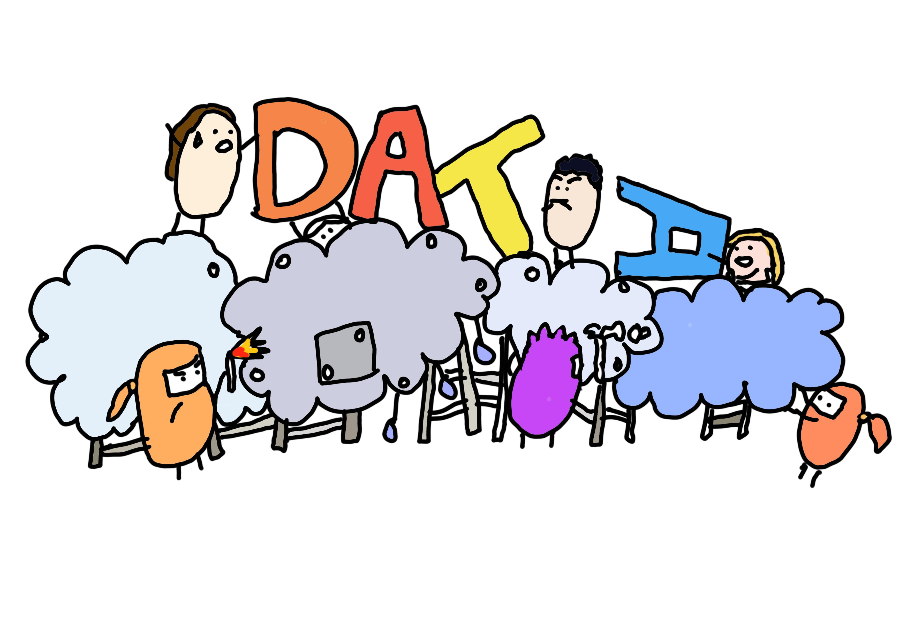

# AWS usage notes - a comprehensive guide for AWS newbies    

      

This repository contains a series of guides on how to set up and use AWS services required for data analysis and data science. The style conventions are:  

+ Code, including AWS command line interface code, is indented in `code blocks`.    
+ AWS console options are styled in ***bold italic*** text.  
+ Resource names are styled in **bold** text.    
   

|      | AWS resource | Topic | Why this is important |   
| :--- | :----------- | :---- | :---------- |   
| :cowboy_hat_face: | Identity & Access Management (IAM) | [Create new AWS user groups, users and access policies](./chapters/iam_roles_and_access_policies.md) | IAM is needed to create and manage users and user groups, who often require different access permissions to different AWS resources. Platform governance and security policies tend to be managed via IAM, to ensure that different users have the appropriate level of access to cloud resources for their work requirements. |      
| :bucket: | S3 bucket | [Manage S3 bucket permissions](./chapters/s3_access_policies.md) | Data sets and data objects must be stored in a central location. S3 is the central data storage service in AWS and object storage permissions can be further finetuned using S3 bucket permissions. |     
| :notebook_with_decorative_cover: | Sagemaker | [Enable Sagemaker IAM roles](./chapters/sagemaker_iam_roles.md) | SageMaker supports data science work by providing a user-friendly integrated development environment (IDE) connected to EC2 instances and docker images for users to program in languages like Python and R. This is where data analysts and data scientists work to clean and analyse data and build statistical or machine learning models. To enable SageMaker functionality, SageMaker service permissions must be managed so that SageMaker can interact with all other required AWS services i.e. S3, Lambda and Glue. |       
| :notebook_with_decorative_cover: | Sagemaker | [Introduction to SageMaker](./chapters/sagemaker_introduction.md) | SageMaker provides users with at least two different ways of accessing a linux virtual environment for data science work; through Jupyter notebook instances or data science docker images via the SageMake Studio IDE. Notebook instances are useful for individual exploratory data science work whereas SageMaker Studio is more useful for production environment ML models requiring MLOps support. It is important to understand these differences to make an informed decision about where to host different types of data science projects. |    
| :notebook_with_decorative_cover: | Sagemaker | Manage R and Python environments |    |     
       
## Tips on learning to use AWS         
+ AWS provides management console (i.e. GUI) and command line options to perform operations. The command line interface, also called CloudShell, can be accessed at the top right panel via the ***>_*** icon.   
+ Create AWS services using shell scripts as this is the most reproducible deployment method (there's nothing wrong with clicking a lot of console buttons, it's just a reproducible practice to deploy and document your actions using shell scripts or code templates).      
+ AWS resources can also be accessed using the Python software development kit (SDK) [`boto3`](https://boto3.amazonaws.com/v1/documentation/api/latest/guide/quickstart.html). For data transformations, use the [`awswrangler`](https://aws-sdk-pandas.readthedocs.io/en/stable/) Python SDK.      

## Other resources    
+ [AWS Command Line Interface Reference ](https://docs.aws.amazon.com/cli/latest/index.html) - official reference for AWS command line interface (CLI) tools for use via CloudShell.     
+ [Data Science on AWS github repository](https://github.com/data-science-on-aws/data-science-on-aws) - contains code snippets for setting up AWS services and creating data science workflows.    

 