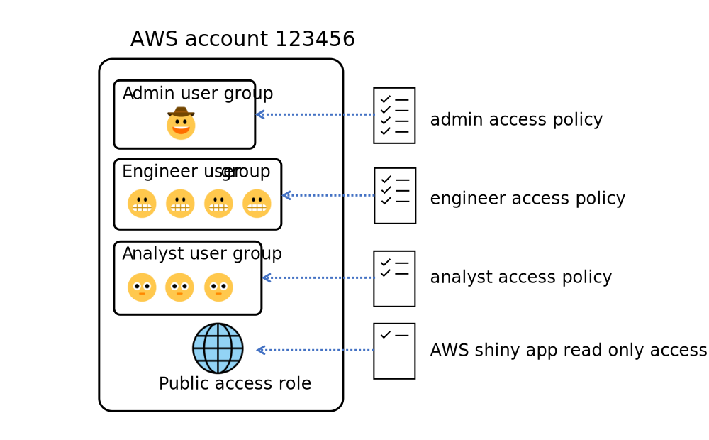

# AWS usage notes  

   

Step 1: [Create root user account](#create-aws-root-user-account)   
Step 2: [Create admin user group, admin access policy and assign users](#create-an-admin-iam-user-group-and-its-access-policy)    
Step 3: [Create non-admin user groups, non-admin access policies and assign users](#create-non-admin-iam-user-groups-and-their-access-policies)       

TODO   
Step 4: [Create S3 buckets and S3 bucket access points ](#create-s3-buckets-and-s3-bucket-access-points)   
Step 5: [Create different IAM policies for different user groups](#create-different-iam-policies-for-different-user-groups)   
Step 6: [Launch an EC2 instance](#launch-an-ec2-instance)    

This repository contains AWS console instructions and command line interface bash snippets for setting up a secure AWS environment. Code snippets are sourced from the [AWS Cookbook](https://github.com/sous-chef/aws) or from [official AWS documentation](https://docs.aws.amazon.com/index.html). Architectural patterns are also sourced from the [UK Ministry of Justice AWS Security Guidelines](https://security-guidance.service.justice.gov.uk/baseline-aws-accounts/#baseline-for-amazon-web-services-accounts) and [Statistics Canada AWS resouces](https://github.com/StatCan/daaas).  

>**Note**  
> You are provided with both a management console (i.e. GUI) or command line option to perform operations inside AWS. The command line interface, also called CloudShell, can be accessed at the top right panel via the **>_** icon. AWS can also be accessed using the Python software development kit (SDK) [`boto3`](https://boto3.amazonaws.com/v1/documentation/api/latest/guide/quickstart.html).   
</br>


# Create AWS root user account   
When you create a free tier personal AWS account, you first create a [root user account](https://docs.aws.amazon.com/IAM/latest/UserGuide/id_root-user.html) which should only be used to:   
+ Create or delete an AWS account
+ Enable MFA for the root user account
+ Create or delete access keys for the root user account
+ Change the password for the root user account
+ Transfer root user account ownership

The first four tasks to complete in your root user account are to: 
1. [Set up multi-factor authentication for your root user account](https://docs.aws.amazon.com/IAM/latest/UserGuide/id_credentials_mfa_enable_virtual.html#enable-virt-mfa-for-root).  
2. [Delete or inactivate your root user access key](https://docs.aws.amazon.com/accounts/latest/reference/root-user-access-key.html), as you should not use your root user account for everyday AWS tasks. This can be controlled in the top right corner via **Root user account -> Security credentials -> Access management -> Access keys** in the AIM control panel or using `aws iam delete-access-key --access-key-id EXAMPLEACCESSID` in CloudShell.  
3. [Enable AWS billing alerts and create an AWS billing alarm](https://docs.aws.amazon.com/AmazonCloudWatch/latest/monitoring/monitor_estimated_charges_with_cloudwatch.html).  
    + Navigate to the **AWS Billing console** and tick both **Receive Free Tier Usage Alerts** and **Receive Billing Alerts** and save preferences.  
    + Change the region to **US East (N. Virginia)** via `export AWS_REGION=us-east-1` in CloudShell. Billing metric data is stored in the **US East (N. Virginia)** region.  
    + Navigate to the **CloudWatch console** and create an alarm for **Billing -> Total estimated charge**. Link your alarm to a subscription topic (supported by an AWS messaging service). Confirm your topic subscription via email. An alert should now appear in **CloudWatch -> Alarms -> All alarms** as shown below.  

  

4. Set your default region via `export AWS_REGION=ap-southeast-2` and check your AWS configuration via `aws configure list` in CloudShell.   
</br>


# Create an admin IAM user group and its access policy           
[AWS recommends the creation of managed policies rather than inline policies to control user access to AWS resources.](https://docs.aws.amazon.com/IAM/latest/UserGuide/access_policies_managed-vs-inline.html) Managed policies can be attached to multiple users or user groups and governance is controlled around maintaining a central library of AWS policies. Policy changes automatically apply for all associated users or user groups. Inline policies should only be used when you want to maintain strict one-to-one relationships between a policy and a single AWS identity. 

  

The final task to complete in your root user account is to:
1. Create a new user group named `admin` using **Access management -> User groups** in the IAM console or via `aws iam create-group --group-name admin` in CloudShell.  
2. Create an admin access policy named `admin_access` via **Access management -> Policies -> Create policy** and input the following code into the JSON editor. The condition `"StringEquals": {"aws:RequestedRegion": "ap-southeast-2"}` restricts all AWS resource access to only the Sydney region. Because AWS account management resources like IAM, AWS Cost Explorer, CloudTrail and CloudShell can only be accessed via the global region i.e. default `us-east-1` region, we also need to explicitly allow access to these resources. AWS documentation about the latter step can be accessed [here](https://docs.aws.amazon.com/cloudshell/latest/userguide/sec-auth-with-identities.html).  

    <details><summary>JSON code</summary><p>  
    
    ```json  
    {
    "Version": "2012-10-17",
    "Statement": 
        [
            {
                "Sid": "UseAustralianResourcesOnly",
                "Effect": "Allow",
                "Action": "*",
                "Resource": "*",
                "Condition": {"StringEquals": {"aws:RequestedRegion": "ap-southeast-2"}}
            },

            {
                "Sid": "UseConsole",
                "Effect": "Allow",
                "Action": [
                    "iam:*",
                    "cloudshell:*",
                    "access-analyzer:*",  
                    "aws-portal:ViewUsage",
                    "aws-portal:ViewBilling",
                    "aws-portal:ViewAccount"
                    ],
                "Resource": "*",
                "Condition": {"StringEquals": {"aws:RequestedRegion": "us-east-1"}}
            }
        ]
    }
    ```  
    </p></details>

3. Assign the `admin_access` policy to your previously created `admin` user group through **Access management -> User groups -> admin -> Permissions -> Add permissions -> admin_access** or `aws iam attach-group-policy --group-name admin --policy-arn <admin-access-arn>` in CloudShell.   
4. Create a new user named `admin-<name>` using `Access management -> Users -> Add user`, select **Password - AWS Management Console access** under AWS access type and add to the `admin` user group.  Alternatively, use `aws iam create-user --user-name admin-<name>`, then `aws iam create-login-profile --user-name admin-<name> --password <password>` and then `aws iam add-user-to-group --group-name admin --user-name admin-<name>` in CloudShell.    
5. [Activate admin user access to the AWS Billing console](https://docs.aws.amazon.com/awsaccountbilling/latest/aboutv2/control-access-billing.html) by navigating to **Account -> IAM User and Role Access to Billing Information -> Edit -> Activate IAM Access**.  

You can now log into your administrator account to create more IAM user groups, access policies and users and access other cloud resources.    

>**Note** 
> Access policies should follow the principle of least privilege, where users are given the minimal level of access privileges required for task completion. As a result, for non-admin user groups, applying JSON policy settings using `"Resource": "*"` or `"Action": "*"` are discouraged.    

>**Note** 
> You can test whether your `admin` JSON policy has been correctly applied by checking that you can access **IAM**, **CloudShell** and **Cost Explorer** via `us-east-1`, but can only launch an EC2 instance from `ap-southeast-2` as user `admin-<name>`.   
</br>   


# Create non-admin IAM user groups and their access policies        
Log in via your `admin-<name>` IAM account to create more user groups. You can use the IAM console or CloudShell to create:    

+ An `engineer` user group for individuals with `GET` and `PUT` access to all S3 and Glue resources.   
+ A `analyst` user group for individuals with `GET` access to the `source` S3 bucket and `GET` and `PUT` access to specific folders in the `projects` S3 bucket. This user group also has `GET` and `PUT` access to all EC2 instances, Sagemaker, Lambda and ECS.     

| Role type | Role | Engineer | Analyst |    
| --------- | ---- | -------- | ------- |     
| Platform Ops | View IAM policies | :heavy_check_mark: | :heavy_check_mark: |  
| Platform Ops | Create IAM policies | :x: | :x: |   
| Platform Ops | Manage MFA | :heavy_check_mark: | :heavy_check_mark: |    
| Platform Ops | Manage access keys | :x: | :x: |     
| Platform Ops | Access AWS CodeCommit | :heavy_check_mark: | :heavy_check_mark: |     
| Engineering | Access AWS Glue | :heavy_check_mark: | :x: |    
| Engineering | Get objects inside `source` S3 bucket | :heavy_check_mark: | :heavy_check_mark: |    
| Engineering | Put objects inside `source` S3 bucket | :heavy_check_mark: | :x: |    
| Analysis | Put objects inside `projects` S3 bucket | :heavy_check_mark: | :heavy_check_mark: |    
| Analysis | Get objects inside `source` S3 bucket | :heavy_check_mark: | :heavy_check_mark: |     
| Analysis | Access AWS Sagemaker | :heavy_check_mark: | :heavy_check_mark: |     
| Cloud compute | Create EC2 instances | :heavy_check_mark: | :heavy_check_mark: |    
| Cloud compute | Access AWS Lambda | :heavy_check_mark: | :heavy_check_mark: |    
| Containerisation | Access AWS ECS | :heavy_check_mark: | :heavy_check_mark: |    

To create an `engineer` user group:  
1. Create a new user group named `engineer` using **Access management -> User groups** in the IAM console or via `aws iam create-group --group-name engineer` in CloudShell.   
2. Create an engineer access policy named `engineer_access` via **Access management -> Policies -> Create policy** and input the following code into the JSON editor.    

    <details><summary>JSON code</summary><p>  

    ```json  
    {
    "Version": "2012-10-17",
    "Statement": 
        [
            {
                "Sid": "UseEngineeringResources",
                "Effect": "Allow",
                "Action": [
                    "ec2:*",
                    "glue:*",
                    "cloudshell:*"
                    ],
                "Resource": "*",
                "Condition": {"StringEquals": {"aws:RequestedRegion": "ap-southeast-2"}}
            },

            {
                "Sid": "UseCodeCommit",
                "Effect": "Allow",
                "Action": "codecommit:*",
                "Resource": "arn:aws:codecommit:ap-southeast-2:<aws-account-id>:*",   
                "Condition": {"StringEquals": {"aws:RequestedRegion": "ap-southeast-2"}}
            },
        
            {
                "Sid": "AccessAllS3Settings",
                "Effect": "Allow",
                "Action": "s3:*",
                "Resource": "arn:aws:s3:::*", 
                "Condition": {"StringEquals": {"aws:RequestedRegion": "ap-southeast-2"}}
            },

            {
                "Sid": "DenyUnencryptedS3ObjectUploads",
                "Effect": "Deny",
                "Action": "s3:PutObject",
                "Resource": "arn:aws:s3:::*",
                "Condition": {"Null": {"s3:x-amz-server-side-encryption": true}}
            },
        
            {
                "Sid": "UseConsole",
                "Effect": "Allow",
                "Action": [
                    "cloudshell:*",
                    "iam:PassRole",
                    "aws-portal:ViewUsage",
                    "aws-portal:ViewBilling",
                    "aws-portal:ViewAccount",
                    "iam:GetAccountPasswordPolicy",
                    "iam:ListMFADevices",
                    "iam:ListPolicies"
                    ],
                "Resource": "*",
                "Condition": {"StringEquals": {"aws:RequestedRegion": "us-east-1"}}
            },
            
            {
                "Sid": "ManageOwnMFADevice",
                "Effect": "Allow",
                "Action": [
                    "iam:CreateVirtualMFADevice",
                    "iam:DeleteVirtualMFADevice",
                    "iam:ListMFADevices",  
                    "iam:EnableMFADevice",
                    "iam:DeactivateMFADevice",
                    "iam:ResyncMFADevice"
                    ], 
                "Resource": "arn:aws:iam::*:mfa/${aws:username}",
                "Condition": {"StringEquals": {"aws:RequestedRegion": "us-east-1"}}
            },

            {
                "Sid": "ManageOwnSecurityCredentials",
                "Effect": "Allow",
                "Action": [
                    "iam:CreateServiceSpecificCredential",
                    "iam:DeleteServiceSpecificCredential",
                    "iam:ListServiceSpecificCredentials",
                    "iam:ResetServiceSpecificCredential",
                    "iam:UpdateServiceSpecificCredential",
                    "iam:CreateAccessKey",
                    "iam:DeleteAccessKey",
                    "iam:ListAccessKeys",
                    "iam:UpdateAccessKey",
                    "iam:GetAccessKeyLastUsed"
                    "iam:ChangePassword",
                    "iam:GetUser"  
                    ],
                "Resource": "arn:aws:iam::*:user/${aws:username}",
                "Condition": {"StringEquals": {"aws:RequestedRegion": "us-east-1"}}
            }
        ]
    }
    ```  
    </p></details>

    > **Note**   
    > The action `iam:PassRole` is required for `s3:CreateJob`. [User security management](https://docs.aws.amazon.com/IAM/latest/UserGuide/reference_policies_examples_aws_my-sec-creds-self-manage.html) should also be enabled.    

3. Assign the `engineer_access` policy to the `engineer` user group through **Access management -> User groups -> admin -> Permissions -> Add permissions -> engineer_access** or `aws iam attach-group-policy --group-name engineer --policy-arn <engineer-access-arn>` in CloudShell.     
4. Create a new IAM user named `engineer-<name>` using `Access management -> Users -> Add user`, select **Password - AWS Management Console access** under AWS access type and add to the `engineer` user group.     
5. Test that the `engineer_access` policy has been correctly applied. Log into your AWS account as `engineer-<name>` and confirm that you can access CloudShell and create S3 buckets and S3 bucket access points.     

# TODO

To create an `analyst` user group:  
1. Create a new user group named `analyst` using **Access management -> User groups** in the IAM console or via `aws iam create-group --group-name analyst` in CloudShell. 
2. Create a new IAM user named `analyst-<name>` using `Access management -> Users -> Add user`, select **Password - AWS Management Console access** under AWS access type and add to the `analyst` user group.  
</br> 


# Create S3 buckets and S3 bucket access points      
We will first create two S3 bucket resources, one for data ingress and egress from AWS and one for data access inside AWS.  

To create the S3 buckets, log into AWS as an IAM admin user:  
1. [Create a S3 bucket using the S3 console](https://docs.aws.amazon.com/AmazonS3/latest/userguide/creating-bucket.html) and click **Create bucket**.  
2. This takes you to a new page where you need to assign a unique bucket name i.e. `<name>-landing-zone`, confirm your AWS region as `ap-southeast-2`, keep ACLs disabled under **Object Ownership**, block all public access under **Block Public Access settings for this bucket**, enable data object versioning under **Bucket Versioning** and enable server-side encryption using Amazon S3-managed keys under **Default encryption**.   
3. Click **Create bucket**. Navigate to the **Properties** tab to locate the S3 bucket Amazon Resource Name (ARN) i.e. `arn:aws:s3:::<name>-landing-zone`.  
4. Navigate to **Access Points** and create a new access point named `<name>-landing-zone-access`. Select internet under **Network Origin**, block all public access under **Block Public Access settings for this Access Point** and record the Access Point ARN.    
5. Create a S3 bucket policy for `<name>-landing-zone-access` that allows analyst users to also access `arn:aws:s3:::<name>-landing-zone` though its access point.   

    <details><summary>JSON code</summary><p>  

    ```json
    {
        "Version": "2012-10-17",
        "Statement" : 
        [
            {
                "Effect": "Allow",
                "Principal" : {"AWS": "arn:aws:iam::<aws-account-id>:user/analyst-<name>"},
                "Action" : "s3:*",
                "Resource" : "arn:aws:s3:ap-southeast-2:<aws-account-id>:accesspoint/<name>-landing-zone-access",  
                "Condition": {"StringEquals": {"s3:DataAccessPointAccount": "<aws-account-id>"}}
            }
        ]
    }
    ```
    </p></details>

6. Repeat this process and assign an unique name to a second S3 bucket i.e. `<name>-analysis` and second access point i.e. `<name>-analysis-access`. The bucket will then have the Amazon Resource Name `arn:aws:s3:::<name>-analysis` and a separate Access Point ARN and access point bucket policy doe analyst users.      

When ACLs are disabled, the bucket owner i.e. `admin-<name>` automatically owns and has full control over every object in the bucket. The IAM admin user can then create separate bucket policies for different user groups.  

>**Note**  
> It is essential to block all public access settings to S3 buckets. This needs to be managed when you create a S3 bucket resource and when you create its IAM or bucket access policies. Avoid using `"Principal": "*"` at all costs in JSON policies with an `allow` effect, as this will enable public access to your AWS resources.    

>**Note**  
> You can also manage data access at the level of S3 bucket folders as described [here](https://docs.aws.amazon.com/AmazonS3/latest/userguide/walkthrough1.html#walkthrough-background1).    
</br>   


# Create different IAM policies for different user groups    
We ideally want to separate data engineering and data analysis work components using IAM user group policies. When accessing AWS from a private external environment, we might want to restrict data migration tasks to a limited group of individuals i.e. the `engineer` user group. We might also want to restrict data uploads by the `analyst` user group to existing S3 data objects.     
  

## Create an `engineer_access` IAM policy    
1. Create an engineer access policy named `engineer_access` via **Access management -> Policies -> Create policy** and input the following code into the JSON editor.  

    <details><summary>JSON code</summary><p>  

    ```json  
    {
    "Version": "2012-10-17",
    "Statement": 
        [
            {
                "Sid": "UseEngineeringResources",
                "Effect": "Allow",
                "Action": [
                    "ec2:*",
                    "glue:*",
                    "cloudshell:*"
                    ],
                "Resource": "*",
                "Condition": {"StringEquals": {"aws:RequestedRegion": "ap-southeast-2"}}
            },
        
            {
                "Sid": "AccessAllS3Settings",
                "Effect": "Allow",
                "Action": "s3:*",
                "Resource": "arn:aws:s3:::*", 
                "Condition": {"StringEquals": {"aws:RequestedRegion": "ap-southeast-2"}}
            },

            {
                "Sid": "DenyUnencryptedS3ObjectUploads",
                "Effect": "Deny",
                "Action": "s3:PutObject",
                "Resource": "arn:aws:s3:::*",
                "Condition": {"Null": {"s3:x-amz-server-side-encryption": true}}
            },
        
            {
                "Sid": "UseConsole",
                "Effect": "Allow",
                "Action": [
                    "cloudshell:*",
                    "iam:PassRole",
                    "aws-portal:ViewUsage",
                    "aws-portal:ViewBilling",
                    "aws-portal:ViewAccount",
                    "iam:GetAccountPasswordPolicy",
                    "iam:ListMFADevices",
                    "iam:ListPolicies"
                    ],
                "Resource": "*",
                "Condition": {"StringEquals": {"aws:RequestedRegion": "us-east-1"}}
            },
            
            {
                "Sid": "ManageOwnVirtualMFADevice",
                "Effect": "Allow",
                "Action": [
                    "iam:CreateVirtualMFADevice",
                    "iam:DeleteVirtualMFADevice"
                    ],
                "Resource": "arn:aws:iam::*:mfa/${aws:username}",
                "Condition": {"StringEquals": {"aws:RequestedRegion": "us-east-1"}}
            },

            {
                "Sid": "ManageOwnSecurityCredentials",
                "Effect": "Allow",
                "Action": [
                    "iam:DeactivateMFADevice",
                    "iam:EnableMFADevice",
                    "iam:ListMFADevices",
                    "iam:ResyncMFADevice",
                    "iam:CreateServiceSpecificCredential",
                    "iam:DeleteServiceSpecificCredential",
                    "iam:ListServiceSpecificCredentials",
                    "iam:ResetServiceSpecificCredential",
                    "iam:UpdateServiceSpecificCredential",
                    "iam:CreateAccessKey",
                    "iam:DeleteAccessKey",
                    "iam:ListAccessKeys",
                    "iam:UpdateAccessKey",
                    "iam:GetAccessKeyLastUsed"
                    "iam:ChangePassword",
                    "iam:GetUser"
                    ],
                "Resource": "arn:aws:iam::*:user/${aws:username}",
                "Condition": {"StringEquals": {"aws:RequestedRegion": "us-east-1"}}
            }
        ]
    }
    ```  
    </p></details>

    > **Note**   
    > AWS resource access for the `engineer` user group includes unrestricted access to Glue and all S3 buckets. The action `iam:PassRole` is required for `s3:CreateJob`. [User security management](https://docs.aws.amazon.com/IAM/latest/UserGuide/reference_policies_examples_aws_my-sec-creds-self-manage.html) should also be enabled.    

2. Assign the `engineer_access` policy to your previously created `engineer` user group through **Access management -> User groups -> admin -> Permissions -> Add permissions -> engineer_access** or `aws iam attach-group-policy --group-name engineer --policy-arn <engineer-access-arn>` in CloudShell.      
3. Test that the `engineer_access` policy has been correctly applied. Log into your AWS account as `engineer-<name>` and confirm that you can access CloudShell, upload and delete data objects and create S3 bucket access points.  
4. Upload a test dataset in `arn:aws:s3:::<name>-landing-zone/raw`. Confirm that you can copy the test dataset with encryption into `arn:aws:s3:::<name>-analysis` using `aws s3 cp s3://<name>-landing-zone/raw/test.csv s3://<name>-analysis/test.csv --sse AES256` in CloudShell.  
5. Confirm that unencrypted data uploads are denied i.e. `aws s3 cp s3://<name>-landing-zone/raw/test.csv s3://<name>-analysis/test.csv` fails in CloudShell.   

## Create an `analyst_access` IAM policy  
1. Create an analyst access policy via **Access management -> Policies -> Create policy** and input the following code into the JSON editor.   

    <details><summary>JSON code</summary><p>  
    
    ```json   
    {
    "Version": "2012-10-17",
    "Statement": 
        [
            {
                "Sid": "UseDataScienceResources",
                "Effect": "Allow",
                "Action": [
                    "ec2:*",
                    "ecs:*",
                    "lambda:*",
                    "sagemaker:*",
                    "cloudshell:*"
                    ],
                "Resource": "*",
                "Condition": {"StringEquals": {"aws:RequestedRegion": "ap-southeast-2"}}
            },
            
            {
                "Sid": "AccessAllS3Settings",
                "Effect": "Allow",
                "Action": [
                    "s3:ListAllMyBuckets",
                    "s3:ListBucket",
                    "s3:ListBucketVersions",
                    "s3:GetBucketVersioning",
                    "s3:GetBucketPolicyStatus",
                    "s3:GetBucketPublicAccessBlock",
                    "s3:GetAccountPublicAccessBlock",
                    "s3:GetBucketAcl",
                    "s3:GetObjectAcl",
                    "s3:ListAccessPointsForObjectLambda",
                    "s3:ListBucketMultipartUploads",
                    "s3:ListAccessPoints",
                    "s3:GetAccessPoint",
                    "s3:CreateAccessPoint",
                    "s3:ListJobs",
                    "s3:CreateJob",
                    "s3:ListStorageLensConfigurations",
                    "s3:PutStorageLensConfiguration",
                    "s3:ListMultipartUploadParts",
                    "s3:ListMultiRegionAccessPoints",
                    "s3:GetBucketLocation", 
                    "s3:GetBucketPolicy",
                    "s3:GetBucketLogging",
                    "s3:GetBucketNotification",
                    "s3:GetBucketLocation",
                    "s3:GetEncryptionConfiguration"
                    ],
                "Resource": "arn:aws:s3:::*", 
                "Condition": {"StringEquals": {"aws:RequestedRegion": "ap-southeast-2"}}
            },

            {
                "Sid": "GetAllS3Buckets",
                "Effect": "Allow",
                "Action": [
                    "s3:GetObject",
                    "s3:GetObjectVersion", 
                    "s3:GetObjectVersionAttributes",
                    "s3:GetObjectAttributes"
                    ],
                "Resource": [
                    "arn:aws:s3:::<name>-landing-zone/*",
                    "arn:aws:s3:::<name>-analysis/*"
                    ], 
                "Condition": {"StringEquals": {"aws:RequestedRegion": "ap-southeast-2"}}
            },

            {
                "Sid": "CreateFoldersInAnalysisS3Bucket",
                "Effect": "Allow",
                "Action": [
                    "s3:PutObject",
                    "s3:DeleteObject"
                    ],
                "Resource": "arn:aws:s3:::<name>-analysis/*/", 
                "Condition": {"StringEquals": {"aws:RequestedRegion": "ap-southeast-2"}}
            },

            {
                "Sid": "DeleteObjectsInAnalysisS3Bucket",
                "Effect": "Allow",
                "Action": "s3:DeleteObject",
                "Resource": "arn:aws:s3:::<name>-analysis/*", 
                "Condition": {"StringEquals": {"aws:RequestedRegion": "ap-southeast-2"}}
            },

            {
                "Sid": "PutAnalysisS3BucketLimitedBySource",
                "Effect": "Allow",
                "Action": [
                    "s3:PutObject",
                    "s3:CopyObject"
                    ],
                "Resource": "arn:aws:s3:::<name>-analysis/*", 
                "Condition": {
                    "StringEquals": {"aws:RequestedRegion": "ap-southeast-2"},
                    "ForAnyValue:StringEquals": {"s3:DataAccessPointArn": [
                        "<access-point-arn>-<name>-landing-zone>",
                        "<access-point-arn>-<name>-analysis>"
                        ]}  
                    }
            },

            {
                "Sid": "DenyUnencryptedS3ObjectUploads",
                "Effect": "Deny",
                "Action": "s3:PutObject",
                "Resource": "arn:aws:s3:::*",
                "Condition": {"Null": {"s3:x-amz-server-side-encryption": true}}
            },

            {
                "Sid": "UseConsole",
                "Effect": "Allow",
                "Action": [
                    "cloudshell:*",
                    "iam:PassRole",
                    "aws-portal:ViewUsage",
                    "aws-portal:ViewBilling",
                    "aws-portal:ViewAccount",
                    "iam:GetAccountPasswordPolicy",
                    "iam:ListMFADevices",
                    "iam:ListPolicies"
                    ],
                "Resource": "*",
                "Condition": {"StringEquals": {"aws:RequestedRegion": "us-east-1"}}
            },
            
            {
                "Sid": "ManageOwnVirtualMFADevice",
                "Effect": "Allow",
                "Action": [
                    "iam:CreateVirtualMFADevice",
                    "iam:DeleteVirtualMFADevice"
                    ],
                "Resource": "arn:aws:iam::*:mfa/${aws:username}",
                "Condition": {"StringEquals": {"aws:RequestedRegion": "us-east-1"}}
            },

            {
                "Sid": "ManageOwnSecurityCredentials",
                "Effect": "Allow",
                "Action": [
                    "iam:DeactivateMFADevice",
                    "iam:EnableMFADevice",
                    "iam:ListMFADevices",
                    "iam:ResyncMFADevice",
                    "iam:CreateServiceSpecificCredential",
                    "iam:DeleteServiceSpecificCredential",
                    "iam:ListServiceSpecificCredentials",
                    "iam:ResetServiceSpecificCredential",
                    "iam:UpdateServiceSpecificCredential",
                    "iam:CreateAccessKey",
                    "iam:DeleteAccessKey",
                    "iam:ListAccessKeys",
                    "iam:UpdateAccessKey",
                    "iam:GetAccessKeyLastUsed",
                    "iam:ChangePassword",
                    "iam:GetUser"
                    ],
                "Resource": "arn:aws:iam::*:user/${aws:username}",
                "Condition": {"StringEquals": {"aws:RequestedRegion": "us-east-1"}}
            }
        ]
    }
    ```  
    </p></details>  

    >**Note**  
    > AWS resource access for the `analyst` user group includes unrestricted access to EC2, Sagemaker, Lambda and ECS. `GET` access to all S3 buckets is permitted but `PUT` access is limited to `arn:aws:s3:::<name>-analysis` conditional on the source access points being `<name>-landing-zone-access` or `<name>-analysis-access`.   

2. Assign the `analyst_access` policy to your previously created `analyst` user group through **Access management -> User groups -> admin -> Permissions -> Add permissions -> analyst_access**.        
3. Confirm that the `analyst_access` policy has been correctly applied. Log into your AWS account as `analyst-<name>` and confirm that you can open but not create new encrypted data objects or folders in `arn:aws:s3:::<name>-landing-zone`. Confirm that you can create and delete encrypted folders in `arn:aws:s3:::<name>-analysis`.  
4. Confirm that # TODO  

## CLI tests for engineer and analyst user groups   
To test our IAM policies, we can also run the following tests in CloudShell from the `engineer-<name>` and `analyst-<name>` IAM user accounts.  

| CLI test | engineer | analyst |  
| ------------------------------------------------------------------------------------ | ------------------ | --- |   
| `echo "hi" \| aws s3 cp - s3://<name>-landing-zone/test/hw.txt --sse AES256` | :heavy_check_mark: | :x: |   
| `aws s3 ls s3://<name>-landing-zone/test/`  | :heavy_check_mark:  | :heavy_check_mark: |     
| `echo "hi" \| aws s3 cp - s3://<name>-analysis/test/hw.txt --sse AES256` | :heavy_check_mark: | :x: |     
| `aws s3 ls s3://<name>-analysis/test/` | :heavy_check_mark:  | :heavy_check_mark: |     
| `aws s3 cp s3://<name>-landing-zone/test/hw.txt s3://<name>-analysis/test/hw_copy.txt --sse AES256` | :heavy_check_mark: | Failed |     
| `aws s3 cp s3://<name>-analysis/test/hw.txt s3://<name>-landing-zone/test/hw_copy.txt --sse AES256` | :heavy_check_mark: | :x: |   
| `aws s3 cp s3://<name>-analysis/test/hw.txt s3://<name>-analysis/test_copy/hw_copy.txt --sse AES256` |  | Failed |     
| `aws s3 rm s3://<name>-landing-zone/test/hw_copy.txt` | :heavy_check_mark:  | :x: |   
| `aws s3 rm s3://<name>-analysis/test/hw_copy.txt` | :heavy_check_mark:  | :heavy_check_mark: |   
| `aws s3 cp s3://<name>-landing-zone/test/hw.txt s3://<name>-analysis/test/hw.txt` | :x: | :x: |    

>**Note**  
> You can also test the generation of JSON policies using the [AWS policy generator wizard](https://awspolicygen.s3.amazonaws.com/policygen.html) and read more details about creating IAM policies with different S3 permissions [here](https://aws.amazon.com/blogs/security/writing-iam-policies-grant-access-to-user-specific-folders-in-an-amazon-s3-bucket/).   
</br>


# Launch an EC2 instance    
An EC2 instance is a virtual server which supports our AWS resources. CloudShell can be viewed as a free version of a general purpose EC2 instance that allows users to run AWS CLI commands to manage infrastructure and automate tasks.       

+ EC2 instance types
    + General purpose instances (small to medium datasets)
    + Compute optimized instances (high CPU for modelling etc.)
    + Memory optimized instances (large datasets need to be processed in-memory)
    + Accelerated computing instances (GPUs?)
    + Storage optimized instances  (data storage applications)

+ Recommendation to run an EC2 instance across at least two avaiability zones within a region (availability zone is a proper subset of a region).  
+ Elastic load balancing is based on a region and is used for EC2 scaling. Decoupled architecture from the front end and the back end.   

Elastic Load Balancing (distributes incoming internet traffic) and Amazon EC2 Auto Scaling are separate services, they work together to help ensure that applications running in Amazon EC2 can provide high performance and availability  


# Configure a Sagemaker domain for the analyst user group     


#TODO 

# Manage AWS credentials as an analyst user   
Once the user has been created, see Managing access keys to learn how to create and retrieve the keys used to authenticate the user.

If you have the AWS CLI installed, then you can use the aws configure command to configure your credentials file:

aws configure
Alternatively, you can create the credentials file yourself. By default, its location is ~/.aws/credentials. At a minimum, the credentials file should specify the access key and secret access key. In this example, the key and secret key for the account are specified the default profile:

[default]
aws_access_key_id = YOUR_ACCESS_KEY
aws_secret_access_key = YOUR_SECRET_KEY
You may also want to add a default region to the AWS configuration file, which is located by default at ~/.aws/config:

[default]
region=us-east-1
Alternatively, you can pass a region_name when creating clients and resources.

You have now configured credentials for the default profile as well as a default region to use when creating connections. See Configuration for in-depth configuration sources and options.
#TODO you can set this up to test `boto3`.  


# Other notes 
AWS EKS Amazon Elastic Kubernetes Service
Test docket container 
container orchestration tools 
Test serverless compute via AWS lambda functions 
https://github.com/data-science-on-aws/data-science-on-aws  