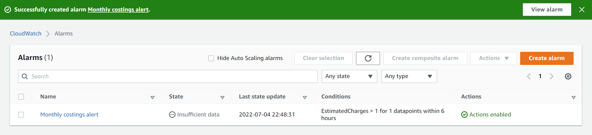

# AWS usage notes  

   

Step 1: [Create root user account](#create-aws-root-user-account)   
Step 2: [Create admin user group, admin access policy and assign users](#create-an-admin-iam-user-group-and-its-access-policy)    
Step 3: [Create non-admin user groups, non-admin access policies and assign users](#create-non-admin-iam-user-groups-and-their-access-policies)       
Step 4: [Create S3 buckets and bucket policies](#create-s3-buckets-and-bucket-policies)    
Step 5: [Test IAM and S3 bucket policies](#test-iam-and-s3-bucket-policies)  

TODO - Step 5: Test IAM and S3 bucket access policies  
TODO - Step 6: Launch an EC2 instance with Sagemaker  

This repository contains AWS console instructions and command line interface bash snippets for setting up a secure AWS environment. Code snippets are sourced from the [AWS Cookbook](https://github.com/sous-chef/aws) or from [official AWS documentation](https://docs.aws.amazon.com/index.html). Architectural patterns are also sourced from the [UK Ministry of Justice AWS Security Guidelines](https://security-guidance.service.justice.gov.uk/baseline-aws-accounts/#baseline-for-amazon-web-services-accounts) and [Statistics Canada AWS resouces](https://github.com/StatCan/daaas).  

>**Note**  
> You are provided with both a management console (i.e. GUI) or command line option to perform operations inside AWS. The command line interface, also called CloudShell, can be accessed at the top right panel via the **>_** icon. AWS can also be accessed using the Python software development kit (SDK) [`boto3`](https://boto3.amazonaws.com/v1/documentation/api/latest/guide/quickstart.html).   
</br>


# Create AWS root user account   
When you create a free tier personal AWS account, you first create a [root user account](https://docs.aws.amazon.com/IAM/latest/UserGuide/id_root-user.html) which should only be used to:   
+ Create or delete an AWS account
+ Enable MFA for the root user account
+ Create or delete access keys for the root user account
+ Change the password for the root user account
+ Transfer root user account ownership

The first four tasks to complete in your root user account are to: 
1. [Set up multi-factor authentication for your root user account](https://docs.aws.amazon.com/IAM/latest/UserGuide/id_credentials_mfa_enable_virtual.html#enable-virt-mfa-for-root).  
2. [Delete or inactivate your root user access key](https://docs.aws.amazon.com/accounts/latest/reference/root-user-access-key.html), as you should not use your root user account for everyday AWS tasks. This can be controlled in the top right corner via **Root user account -> Security credentials -> Access management -> Access keys** in the AIM control panel or using `aws iam delete-access-key --access-key-id EXAMPLEACCESSID` in CloudShell.  
3. [Enable AWS billing alerts and create an AWS billing alarm](https://docs.aws.amazon.com/AmazonCloudWatch/latest/monitoring/monitor_estimated_charges_with_cloudwatch.html).  
    + Navigate to the **AWS Billing console** and tick both **Receive Free Tier Usage Alerts** and **Receive Billing Alerts** and save preferences.  
    + Change the region to **US East (N. Virginia)** via `export AWS_REGION=us-east-1` in CloudShell. Billing metric data is stored in the **US East (N. Virginia)** region.  
    + Navigate to the **CloudWatch console** and create an alarm for **Billing -> Total estimated charge**. Link your alarm to a subscription topic (supported by an AWS messaging service). Confirm your topic subscription via email. An alert should now appear in **CloudWatch -> Alarms -> All alarms** as shown below.  

  

4. Set your default region via `export AWS_REGION=ap-southeast-2` and check your AWS configuration via `aws configure list` in CloudShell.   
</br>


# Create an admin IAM user group and its access policy           
[AWS recommends the creation of managed policies rather than inline policies to control user access to AWS resources.](https://docs.aws.amazon.com/IAM/latest/UserGuide/access_policies_managed-vs-inline.html) Managed policies can be attached to multiple users or user groups and governance is controlled around maintaining a central library of AWS policies. Policy changes automatically apply for all associated users or user groups. Inline policies should only be used when you want to maintain strict one-to-one relationships between a policy and a single AWS identity. 

  

The final task to complete in your root user account is to:
1. Create a new user group named `admin` using **Access management -> User groups** in the IAM console or via `aws iam create-group --group-name admin` in CloudShell.  
2. Create an admin access policy named `admin_access` via **Access management -> Policies -> Create policy** and input the following code into the JSON editor. The condition `"StringEquals": {"aws:RequestedRegion": "ap-southeast-2"}` restricts all AWS resource access to only the Sydney region. Because AWS account management resources like IAM, AWS Cost Explorer, CloudTrail and CloudShell can only be accessed via the global region i.e. default `us-east-1` region, we also need to explicitly allow access to these resources. AWS documentation about the latter step can be accessed [here](https://docs.aws.amazon.com/cloudshell/latest/userguide/sec-auth-with-identities.html).  

    <details><summary>JSON code</summary><p>  
    
    ```json  
    {
    "Version": "2012-10-17",
    "Statement": 
        [
            {
                "Sid": "UseAustralianResourcesOnly",
                "Effect": "Allow",
                "Action": "*",
                "Resource": "*",
                "Condition": {"StringEquals": {"aws:RequestedRegion": "ap-southeast-2"}}
            },

            {
                "Sid": "UseConsole",
                "Effect": "Allow",
                "Action": [
                    "iam:*",
                    "cloudshell:*",
                    "access-analyzer:*",  
                    "aws-portal:ViewUsage",
                    "aws-portal:ViewBilling",
                    "aws-portal:ViewAccount"
                    ],
                "Resource": "*",
                "Condition": {"StringEquals": {"aws:RequestedRegion": "us-east-1"}}
            }
        ]
    }
    ```  
    </p></details>

3. Assign the `admin_access` policy to your previously created `admin` user group through **Access management -> User groups -> admin -> Permissions -> Add permissions -> admin_access** or `aws iam attach-group-policy --group-name admin --policy-arn <admin-access-arn>` in CloudShell.   
4. Create a new user named `admin-<name>` using `Access management -> Users -> Add user`, select **Password - AWS Management Console access** under AWS access type and add to the `admin` user group.  Alternatively, use `aws iam create-user --user-name admin-<name>`, then `aws iam create-login-profile --user-name admin-<name> --password <password>` and then `aws iam add-user-to-group --group-name admin --user-name admin-<name>` in CloudShell.    
5. [Activate admin user access to the AWS Billing console](https://docs.aws.amazon.com/awsaccountbilling/latest/aboutv2/control-access-billing.html) by navigating to **Account -> IAM User and Role Access to Billing Information -> Edit -> Activate IAM Access**.  

You can now log into your administrator account to create more IAM user groups, access policies and users and access other cloud resources.    

>**Note** 
> Access policies should follow the principle of least privilege, where users are given the minimal level of access privileges required for task completion. As a result, for non-admin user groups, applying JSON policy settings using `"Resource": "*"` or `"Action": "*"` are discouraged.    

>**Note** 
> You can test whether your admin JSON policy has been correctly applied by checking that you can access **IAM**, **CloudShell** and **Cost Explorer** via `us-east-1`, but can only launch an EC2 instance from `ap-southeast-2` as user `admin-<name>`.   
</br>   


# Create non-admin IAM user groups and their access policies        
Log in via your `admin-<name>` IAM account to create more user groups. You can use the IAM console or CloudShell to create:    

+ An `engineer` user group for individuals with read and `write access to all S3 and Glue resources.   
+ A `analyst` user group for individuals with read access to the `source` S3 bucket and read and write access to specific folders in the `projects` S3 bucket. This user group also has read and write access to all EC2 instances, Sagemaker, Lambda and ECS.     

| Role type | Role | Engineer | Analyst |    
| --------- | ---- | -------- | ------- |     
| Platform Ops | View IAM policies | :heavy_check_mark: | :heavy_check_mark: |    
| Platform Ops | Create IAM policies | :x: | :x: |   
| Platform Ops | Manage MFA | :heavy_check_mark: | :heavy_check_mark: |    
| Platform Ops | Manage access keys | :heavy_check_mark: | :heavy_check_mark: |     
| Platform Ops | Access AWS CodeCommit | :heavy_check_mark: | :heavy_check_mark: |     
| Engineering | Access AWS Glue | :heavy_check_mark: | :x: |    
| Engineering | Create S3 buckets | :heavy_check_mark: | :x: |    
| Engineering | Set S3 bucket permissions | :heavy_check_mark: | :x: |    
| Engineering | Read objects inside `source` S3 bucket | :heavy_check_mark: | :heavy_check_mark: |    
| Engineering | Write objects inside `source` S3 bucket | :heavy_check_mark: | :x: |    
| Analysis | Read objects inside `projects` S3 bucket | :heavy_check_mark: | :heavy_check_mark: |    
| Analysis | Write objects inside `source` S3 bucket | :heavy_check_mark: | :heavy_check_mark: |     
| Analysis | Access AWS Sagemaker | :heavy_check_mark: | :heavy_check_mark: |     
| Cloud compute | Create EC2 instances | :heavy_check_mark: | :heavy_check_mark: |    
| Cloud compute | Access AWS Lambda | :heavy_check_mark: | :heavy_check_mark: |    
| Containerisation | Access AWS ECS | :heavy_check_mark: | :heavy_check_mark: |    
</br>   

To create an `engineer` user group:  
1. Create a new user group named `engineer` using **Access management -> User groups** in the IAM console or via `aws iam create-group --group-name engineer` in CloudShell.   
2. Create an engineer access policy named `engineer_access` via **Access management -> Policies -> Create policy** and input the following code into the JSON editor.    

    <details><summary>JSON code</summary><p>  

    ```json  
    {
    "Version": "2012-10-17",
    "Statement": 
        [
            {
                "Sid": "UseEngineeringResources",
                "Effect": "Allow",
                "Action": [
                    "ec2:*",
                    "glue:*",
                    "cloudshell:*",
                    "s3:*"
                    ],
                "Resource": "*",
                "Condition": {"StringEquals": {"aws:RequestedRegion": "ap-southeast-2"}}
            },

            {
                "Sid": "UseCodeCommit",
                "Effect": "Allow",
                "Action": "codecommit:*",
                "Resource": "arn:aws:codecommit:ap-southeast-2:<aws-account-id>:*",   
                "Condition": {"StringEquals": {"aws:RequestedRegion": "ap-southeast-2"}}
            },

            {
                "Sid": "DenyUnencryptedS3ObjectUploads",
                "Effect": "Deny",
                "Action": "s3:PutObject",
                "Resource": "arn:aws:s3:::*",
                "Condition": {"Null": {"s3:x-amz-server-side-encryption": true}}
            },
        
            {
                "Sid": "UseConsole",
                "Effect": "Allow",
                "Action": [
                    "cloudshell:*",
                    "iam:PassRole",
                    "aws-portal:ViewUsage",
                    "aws-portal:ViewBilling",
                    "aws-portal:ViewAccount",
                    "iam:GetAccountPasswordPolicy",
                    "iam:ListMFADevices",
                    "iam:ListPolicies"
                    ],
                "Resource": "*",
                "Condition": {"StringEquals": {"aws:RequestedRegion": "us-east-1"}}
            },
            
            {
                "Sid": "ManageOwnMFADevice",
                "Effect": "Allow",
                "Action": [
                    "iam:CreateVirtualMFADevice",
                    "iam:DeleteVirtualMFADevice",
                    "iam:ListMFADevices",  
                    "iam:EnableMFADevice",
                    "iam:DeactivateMFADevice",
                    "iam:ResyncMFADevice"
                    ], 
                "Resource": "arn:aws:iam::*:mfa/${aws:username}",
                "Condition": {"StringEquals": {"aws:RequestedRegion": "us-east-1"}}
            },

            {
                "Sid": "ManageOwnSecurityCredentials",
                "Effect": "Allow",
                "Action": [
                    "iam:CreateServiceSpecificCredential",
                    "iam:DeleteServiceSpecificCredential",
                    "iam:ListServiceSpecificCredentials",
                    "iam:ResetServiceSpecificCredential",
                    "iam:UpdateServiceSpecificCredential",
                    "iam:CreateAccessKey",
                    "iam:DeleteAccessKey",
                    "iam:ListAccessKeys",
                    "iam:UpdateAccessKey",
                    "iam:GetAccessKeyLastUsed"
                    "iam:ChangePassword",
                    "iam:GetUser"  
                    ],
                "Resource": "arn:aws:iam::*:user/${aws:username}",
                "Condition": {"StringEquals": {"aws:RequestedRegion": "us-east-1"}}
            }
        ]
    }
    ```  
    </p></details>   

3. Assign the `engineer_access` policy to the `engineer` user group through **Access management -> User groups -> admin -> Permissions -> Add permissions -> engineer_access** or `aws iam attach-group-policy --group-name engineer --policy-arn <engineer-access-arn>` in CloudShell.     
4. Create a new IAM user named `engineer-<name>` using `Access management -> Users -> Add user`, select **Password - AWS Management Console access** under AWS access type and add to the `engineer` user group.     

> **Note**   
> The action `iam:PassRole` is required for `s3:CreateJob` in the engineer access policy and [user security management](https://docs.aws.amazon.com/IAM/latest/UserGuide/reference_policies_examples_aws_my-sec-creds-self-manage.html) is also enabled.     
</br>   

To create an `analyst` user group:  
1. Create a new user group named `analyst` using **Access management -> User groups** in the IAM console or via `aws iam create-group --group-name analyst` in CloudShell.  
2. Create an analyst access policy via **Access management -> Policies -> Create policy** and input the following code into the JSON editor.   

    <details><summary>JSON code</summary><p>  
    
    ```json   
    {
    "Version": "2012-10-17",
    "Statement": 
        [
            {
                "Sid": "UseDataScienceResources",
                "Effect": "Allow",
                "Action": [
                    "ec2:*",
                    "ecs:*",
                    "lambda:*",
                    "sagemaker:*",
                    "cloudshell:*"
                    ],
                "Resource": "*",
                "Condition": {"StringEquals": {"aws:RequestedRegion": "ap-southeast-2"}}
            },

            {
                "Sid": "UseCodeCommit",
                "Effect": "Allow",
                "Action": "codecommit:*",
                "Resource": "arn:aws:codecommit:ap-southeast-2:<aws-account-id>:*",   
                "Condition": {"StringEquals": {"aws:RequestedRegion": "ap-southeast-2"}}
            },
            
            {
                "Sid": "AccessLimitedS3Resources",
                "Effect": "Allow",
                "Action": [
                    "s3:ListAllMyBuckets",
                    "s3:ListBucket",
                    "s3:ListBucketVersions",
                    "s3:GetBucketVersioning",
                    "s3:GetBucketPolicyStatus",
                    "s3:GetBucketPublicAccessBlock",
                    "s3:GetAccountPublicAccessBlock",
                    "s3:GetBucketAcl",
                    "s3:GetObjectAcl",
                    "s3:ListAccessPointsForObjectLambda",
                    "s3:ListBucketMultipartUploads",
                    "s3:ListAccessPoints",
                    "s3:GetAccessPoint",
                    "s3:ListJobs",
                    "s3:CreateJob",
                    "s3:ListStorageLensConfigurations",
                    "s3:PutStorageLensConfiguration",
                    "s3:ListMultipartUploadParts",
                    "s3:ListMultiRegionAccessPoints",
                    "s3:GetBucketLocation", 
                    "s3:GetBucketPolicy",
                    "s3:GetBucketLogging",
                    "s3:GetBucketNotification",
                    "s3:GetBucketLocation",
                    "s3:GetEncryptionConfiguration"
                    ],
                "Resource": "arn:aws:s3:::*", 
                "Condition": {"StringEquals": {"aws:RequestedRegion": "ap-southeast-2"}}
            },

            {
                "Sid": "DenyUnencryptedS3ObjectUploads",
                "Effect": "Deny",
                "Action": "s3:PutObject",
                "Resource": "arn:aws:s3:::*",
                "Condition": {"Null": {"s3:x-amz-server-side-encryption": true}}
            },

            {
                "Sid": "UseConsole",
                "Effect": "Allow",
                "Action": [
                    "cloudshell:*",
                    "iam:PassRole",
                    "aws-portal:ViewUsage",
                    "aws-portal:ViewBilling",
                    "aws-portal:ViewAccount",
                    "iam:GetAccountPasswordPolicy",
                    "iam:ListMFADevices",
                    "iam:ListPolicies"
                    ],
                "Resource": "*",
                "Condition": {"StringEquals": {"aws:RequestedRegion": "us-east-1"}}
            },
            
            {
                "Sid": "ManageOwnVirtualMFADevice",
                "Effect": "Allow",
                "Action": [
                    "iam:CreateVirtualMFADevice",
                    "iam:DeleteVirtualMFADevice",
                    "iam:DeactivateMFADevice",
                    "iam:EnableMFADevice",
                    "iam:ListMFADevices",
                    "iam:ResyncMFADevice"
                    ],
                "Resource": "arn:aws:iam::*:mfa/${aws:username}",
                "Condition": {"StringEquals": {"aws:RequestedRegion": "us-east-1"}}
            },

            {
                "Sid": "ManageOwnSecurityCredentials",
                "Effect": "Allow",
                "Action": [
                    "iam:CreateServiceSpecificCredential",
                    "iam:DeleteServiceSpecificCredential",
                    "iam:ListServiceSpecificCredentials",
                    "iam:ResetServiceSpecificCredential",
                    "iam:UpdateServiceSpecificCredential",
                    "iam:CreateAccessKey",
                    "iam:DeleteAccessKey",
                    "iam:ListAccessKeys",
                    "iam:UpdateAccessKey",
                    "iam:GetAccessKeyLastUsed",
                    "iam:ChangePassword",
                    "iam:GetUser"
                    ],
                "Resource": "arn:aws:iam::*:user/${aws:username}",
                "Condition": {"StringEquals": {"aws:RequestedRegion": "us-east-1"}}
            }
        ]
    }
    ```  
    </p></details>  

3. Assign the `analyst_access` policy to your previously created `analyst` user group through **Access management -> User groups -> admin -> Permissions -> Add permissions -> analyst_access**.        
4. Create a new IAM user named `analyst-<name>` using `Access management -> Users -> Add user`, select **Password - AWS Management Console access** under AWS access type and add to the `analyst` user group.  

>**Note**  
> AWS resource access for the `analyst` user group includes unrestricted access to EC2, Sagemaker, Lambda and ECS. Bucket access is managed using S3 bucket policies rather than IAM policies.    
</br>      


# Create S3 buckets and bucket policies   
[Access to S3 resources](https://aws.amazon.com/blogs/security/iam-policies-and-bucket-policies-and-acls-oh-my-controlling-access-to-s3-resources/) can be controlled using multiple methods. In general, IAM policies allow or restrict S3 bucket resource permissions for user groups whereas S3 bucket policies are attached to specific S3 buckets and enable fine tuning of S3 bucket content permissions at the [principal](https://docs.aws.amazon.com/IAM/latest/UserGuide/reference_policies_elements_principal.html) i.e. individual user level.       

S3 bucket permissions can be set at the bucket, root level or folder level.  

In our case, we would like to create two S3 bucket resources, one named `source` and one named `projects`.    

+ The `source` bucket will contain a `landing_zone` folder and `bronze_layer` folder, with data analysts granted read access to the `bronze_layer` folder.   
+ The `projects` bucket will contain multiple folders, each hosting a separate project. Analysts have read and write access to their own project folders.   

  

To create the `source` S3 bucket:    
1. Log into AWS using a data engineer user account and navigate to the S3 console and click **Create bucket**.    
2. This takes you to a new page where you need to assign a unique bucket name i.e. `<name>-source`, confirm your AWS region as `ap-southeast-2`, keep ACLs disabled under **Object Ownership**, block all public access under **Block Public Access settings for this bucket**, enable data object versioning under **Bucket Versioning** and enable server-side encryption using Amazon S3-managed keys under **Default encryption**.    
3. Confirm bucket creation by clicking **Create bucket** again.  
4. Click on the newly created bucket and navigate to the **Properties** tab to locate its Amazon Resource Name (ARN) i.e. `arn:aws:s3:::<name>-source`. 
5. Navigate back to the **Object** tab and click **Create folder** to create the `landing_zone` and `bronze_layer` folders. Remember to enable server-side encryption using Amazon S3-managed keys.    
6. Navigate to the **Permissions** tab and scroll down to the [bucket policy](https://docs.aws.amazon.com/AmazonS3/latest/userguide/add-bucket-policy.html) section and click **edit**. Note that only the bucket owner can associate a policy with the S3 bucket.   
7. Create the `source` S3 bucket policy and input the following code into the JSON editor.     

    <details><summary>JSON code</summary><p>  
    
    ```json    
    {
    "Version": "2012-10-17",
    "Statement": 
        [
            {
                "Sid": "RestrictAnalystAccess",
                "Effect": "Allow",  
                "Principal": {
                    "AWS": "arn:aws:iam::<aws-account-id>:user/analyst-<name>"
                },  
                "Action": [
                    "s3:GetObject",
                    "s3:GetObjectVersion",
                    "s3:GetObjectVersionAttributes",
                    "s3:GetObjectAttributes"
                    ],
                "Resource": [
                    "arn:aws:s3:::<name>-source",
                    "arn:aws:s3:::<name>-source/*"
                    ]
            }
        ]
    }
    ```     
    </p></details>   

To create the `projects` S3 bucket:  
1. Remain logged into your data engineer user account and navigate to the S3 console and repeat steps 1 to 4 above i.e. create a new S3 bucket named `<name>-projects` with the same bucket settings.
2. Navigate back to the **Object** tab and click **Create folder** to create the `palmer_penguins` and `nlp_classification` folders. Remember to enable server-side encryption using Amazon S3-managed keys.    
3. Navigate to the **Permissions** tab and scroll down to the [bucket policy](https://docs.aws.amazon.com/AmazonS3/latest/userguide/add-bucket-policy.html) section and click **edit**. Note that only the bucket owner can associate a policy with the S3 bucket.   
4. Create the `projects` S3 bucket policy and input the following code into the JSON editor. This policy only allows the user `analyst-<name>` to have read and write access to the `palmer_penguins` and not `nlp_classification` folder.         

    <details><summary>JSON code</summary><p>  
    
    ```json    
    {
    "Version": "2012-10-17",
    "Statement": 
        [
            {
                "Sid": "AnalystPalmerPenguinAccess",
                "Effect": "Allow", 
                "Principal": {
                    "AWS": "arn:aws:iam::<aws-account-id>:user/analyst-<name>"
                },  
                "Action": [
                    "s3:GetObject",
                    "s3:GetObjectVersion", 
                    "s3:GetObjectVersionAttributes",
                    "s3:GetObjectAttributes",
                    "s3:PutObject"
                    ],
                "Resource": [
                    "arn:aws:s3:::<name>-projects/palmer_penguins",
                    "arn:aws:s3:::<name>-projects/palmer_penguins/*"
                    ]
            },

            {
                "Sid": "AnalystPalmerPenguinDelete",
                "Effect": "Allow",  
                "Principal": {
                    "AWS": "arn:aws:iam::<aws-account-id>:user/analyst-<name>"
                },  
                "Action": "s3:DeleteObject", 
                "Resource": "arn:aws:s3:::<name>-projects/palmer_penguins/*"
            }
        ]
    }
    ```     
    </p></details>   

>**Note**  
> When IAM and S3 bucket policies both exist for a user, access is determined as the least-privilege union of all the user permissions.     

>**Note**  
> It is essential to block all public access settings to S3 buckets. Avoid using `"Principal": "*"` with an `allow` effect in S3 bucket policies, as this will enable public access to your AWS resources.    

>**Note**  
> Avoid setting up S3 bucket permissions using S3 ACLs as this is a legacy system.   


# Test IAM and S3 bucket policies  


