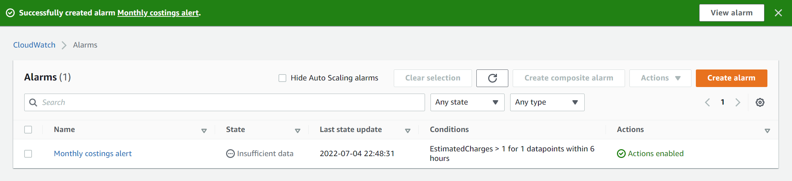

#  Create new AWS user groups, users and access policies    
Step 1: [Create root user account](#create-aws-root-user-account)    
Step 2: [Create admin user group and an admin access policy](#create-an-admin-iam-user-group-and-an-admin-access-policy)     
Step 3: [Create non-admin user groups and non-admin access policies](#create-non-admin-iam-user-groups-and-their-access-policies)        

# Change log    
**2023/01/03**: Creating S3 buckets and S3 bucket policies is only enabled via the global region. Access to `s3:` actions has now also been enabled for the **us-east-1** region for all access policies.  
<br>   

# Create AWS root user account   
When you create a free tier personal AWS account, you need to first create a [root user account](https://docs.aws.amazon.com/IAM/latest/UserGuide/id_root-user.html) which should only be used to:   
+ Create or delete your AWS account
+ Enable MFA for the root user account
+ Create or delete access keys for the root user account
+ Change the password for the root user account
+ Transfer root user account ownership  

The first four tasks to complete in your root user account are to: 
1. [Set up multi-factor authentication for your root user account](https://docs.aws.amazon.com/IAM/latest/UserGuide/id_credentials_mfa_enable_virtual.html#enable-virt-mfa-for-root).  
2. [Delete or inactivate your root user access key](https://docs.aws.amazon.com/accounts/latest/reference/root-user-access-key.html), as you should not use your root user account for everyday AWS tasks. This can be controlled in the top right corner via ***Root user account -> Security credentials -> Access management -> Access keys*** in the AIM control panel or using `aws iam delete-access-key --access-key-id <example_access_id>` in CloudShell.  
3. [Enable AWS billing alerts and create an AWS billing alarm](https://docs.aws.amazon.com/AmazonCloudWatch/latest/monitoring/monitor_estimated_charges_with_cloudwatch.html).  
    + Navigate to the ***AWS Billing console*** and tick both ***Receive Free Tier Usage Alerts*** and ***Receive Billing Alerts*** and save preferences.  
    + Change the region to ***US East (N. Virginia)*** via `export AWS_REGION=us-east-1` in CloudShell. Billing metric data is stored in the **US East (N. Virginia)** region.  
    + Navigate to the ***CloudWatch console*** and create an alarm for ***Billing -> Total estimated charge***. Link your alarm to a subscription topic (supported by an AWS messaging service). Confirm your topic subscription via email. An alert should now appear in ***CloudWatch -> Alarms -> All alarms*** as shown below.   

  

4. Set your default region via `export AWS_REGION=ap-southeast-2` and check your AWS configuration via `aws configure list` in CloudShell.   
</br>

# Create an admin IAM user group and an admin access policy           
[AWS recommends the creation of managed policies rather than inline policies to control user access to AWS resources.](https://docs.aws.amazon.com/IAM/latest/UserGuide/access_policies_managed-vs-inline.html) Managed policies can be attached to multiple users or user groups and governance is controlled around maintaining a central library of AWS policies. Policy changes automatically apply for all associated users or user groups. Inline policies should only be used when you want to maintain strict one-to-one relationships between a policy and a single AWS identity and is not recommended for organisations. 

    

The final task to complete in your root user account is to create an **admin** user group:
1. Create a new user group named **admin** using ***Access management -> User groups*** in the IAM console or via `aws iam create-group --group-name admin` in CloudShell.  
2. Create an admin access policy named **admin_access** via ***Access management -> Policies -> Create policy*** and input the JSON code below into the JSON editor.   
    
    ```json  
    {
    "Version": "2012-10-17",
    "Statement": 
        [
            {
                "Sid": "UseAustralianResourcesOnly",
                "Effect": "Allow",
                "Action": "*",
                "Resource": "*",
                "Condition": {"StringEquals": {"aws:RequestedRegion": "ap-southeast-2"}}
            },

            {
                "Sid": "UseConsole",
                "Effect": "Allow",
                "Action": [
                    "iam:*",
                    "s3:*", 
                    "kms:*", 
                    "cloudshell:*",
                    "access-analyzer:*",  
                    "aws-portal:ViewUsage",
                    "aws-portal:ViewBilling",
                    "aws-portal:ViewAccount"
                    ],
                "Resource": "*",
                "Condition": {"StringEquals": {"aws:RequestedRegion": "us-east-1"}}
            }
        ]
    }
    ```    

    > **Note** 
    > The condition `"StringEquals": {"aws:RequestedRegion": "ap-southeast-2"}` restricts all AWS resource access to only the Sydney region. Because account management resources like IAM, S3, Cost Explorer, Key Management Service, CloudTrail and CloudShell can only be accessed via the global region i.e. default **us-east-1** region, we need to allow **us-east-1** region access for these resources.      

3. Assign the **admin_access** policy to your previously created **admin** user group through ***Access management -> User groups -> admin -> Permissions -> Add permissions -> admin_access*** or `aws iam attach-group-policy --group-name admin --policy-arn <admin_access_arn>` in CloudShell.    
4. Create a new user named **admin_\<name>** using ***Access management -> Users -> Add user***, select ***Password - AWS Management Console access*** under AWS access type and add to the **admin** user group.  Alternatively, use `aws iam create-user --user-name admin_<name>`, then `aws iam create-login-profile --user-name admin_<name> --password <password>` and then `aws iam add-user-to-group --group-name admin --user-name admin_<name>` in CloudShell.    
5. [Activate admin user access to the AWS Billing console](https://docs.aws.amazon.com/awsaccountbilling/latest/aboutv2/control-access-billing.html) by navigating to ***Account -> IAM User and Role Access to Billing Information -> Edit -> Activate IAM Access***.  
6. Log into your AWS account as **admin_\<name>** and test your admin user group IAM policy by checking that you can access IAM, CloudShell and Cost Explorer via **us-east-1** but can only launch an EC2 instance from **ap-southeast-2**.    

You can now log into your administrator account to create more IAM access policies, user groups and users, and access other AWS services.    
   
Access policies should follow the principle of least privilege, where users are given the minimal level of access privileges required for task completion. As a result, for non-admin user groups, applying JSON policy settings using `"Resource": "*"` or `"Action": "*"` is discouraged.            
</br>   

# Create non-admin IAM user groups and their access policies        
Log in via your **admin_\<name>** IAM account to create more user groups. You can use the IAM console or CloudShell to create:    

+ An **engineer** user group for individuals with read and `write access to all EC2 instances, S3, Sagemaker and Glue resources.   
+ An **analyst** user group for individuals with read access to the **source** S3 bucket and read and write access to specific folders in the **projects** S3 bucket. This user group also has read and write access to all EC2 instances, S3, Sagemaker, Glue, Lambda and ECS.      

| Role type | Role | Engineer | Analyst |    
| --------- | ---- | -------- | ------- |     
| Platform Ops | View IAM policies | :heavy_check_mark: | :heavy_check_mark: |    
| Platform Ops | Create IAM policies | :x: | :x: |   
| Platform Ops | Manage MFA | :heavy_check_mark: | :heavy_check_mark: |    
| Platform Ops | Manage access keys | :heavy_check_mark: | :heavy_check_mark: |     
| Platform Ops | Access AWS CodeCommit | :heavy_check_mark: | :heavy_check_mark: |     
| Engineering | Access AWS Glue | :heavy_check_mark: | :heavy_check_mark: |    
| Engineering | Create S3 buckets | :heavy_check_mark: | :x: |    
| Engineering | Create and edit S3 bucket policies | :heavy_check_mark: | :x: |     
| Engineering | Read objects inside **source** S3 bucket | :heavy_check_mark: | :heavy_check_mark: |    
| Engineering | Write objects inside **source** S3 bucket | :heavy_check_mark: | :x: |    
| Analysis | Read objects inside **projects** S3 bucket | :heavy_check_mark: | :heavy_check_mark: |    
| Analysis | Write objects inside **source** S3 bucket | :heavy_check_mark: | :heavy_check_mark: |   
| Analysis | Access AWS Sagemaker | :heavy_check_mark: | :heavy_check_mark: |     
| Cloud compute | Access EC2 instances | :heavy_check_mark: | :heavy_check_mark: |     
| Cloud compute | Access AWS Lambda | :heavy_check_mark: | :heavy_check_mark: |     
| Containerisation | Create AWS ECS images | :heavy_check_mark: | :heavy_check_mark: |     
</br>   

## Create an engineer user group   
To create an **engineer** user group:  
1. Create a new user group named **engineer** using ***Access management -> User groups*** in the IAM console or via `aws iam create-group --group-name engineer` in CloudShell.   
2. Create an engineer access policy named **engineer_access** via ***Access management -> Policies -> Create policy*** and input the following code into the JSON editor.    

    ```json  
    {
    "Version": "2012-10-17",
    "Statement": 
        [
            {
                "Sid": "UseEngineeringResources",
                "Effect": "Allow",
                "Action": [
                    "ec2:*",
                    "ecs:*",
                    "lambda:*",
                    "glue:*",
                    "cloudshell:*",
                    "sagemaker:*",
                    "s3:*"
                    ],
                "Resource": "*",
                "Condition": {"StringEquals": {"aws:RequestedRegion": "ap-southeast-2"}}
            },

            {
                "Sid": "DenyUnencryptedS3ObjectUploads",
                "Effect": "Deny",
                "Action": "s3:PutObject",
                "Resource": "arn:aws:s3:::*",
                "Condition": {"Null": {"s3:x-amz-server-side-encryption": true}}
            },
        
            {
                "Sid": "UseConsole",
                "Effect": "Allow",
                "Action": [
                    "cloudshell:*",
                    "s3:*", 
                    "iam:PassRole",
                    "aws-portal:ViewUsage",
                    "aws-portal:ViewBilling",
                    "aws-portal:ViewAccount",
                    "iam:GetAccountPasswordPolicy",
                    "iam:ListMFADevices",
                    "iam:ListPolicies",
                    "iam:GetRole",
                    "iam:CreateServiceLinkedRole",
                    "servicecatalog:*"
                    ],
                "Resource": "*",
                "Condition": {"StringEquals": {"aws:RequestedRegion": "us-east-1"}}
            },
            
            {
                "Sid": "ManageOwnMFADevice",
                "Effect": "Allow",
                "Action": [
                    "iam:CreateVirtualMFADevice",
                    "iam:DeleteVirtualMFADevice",
                    "iam:ListMFADevices",  
                    "iam:EnableMFADevice",
                    "iam:DeactivateMFADevice",
                    "iam:ResyncMFADevice"
                    ], 
                "Resource": "arn:aws:iam::*:mfa/${aws:username}",
                "Condition": {"StringEquals": {"aws:RequestedRegion": "us-east-1"}}
            },

            {
                "Sid": "ManageOwnSecurityCredentials",
                "Effect": "Allow",
                "Action": [
                    "iam:CreateServiceSpecificCredential",
                    "iam:DeleteServiceSpecificCredential",
                    "iam:ListServiceSpecificCredentials",
                    "iam:ResetServiceSpecificCredential",
                    "iam:UpdateServiceSpecificCredential",
                    "iam:CreateAccessKey",
                    "iam:DeleteAccessKey",
                    "iam:ListAccessKeys",
                    "iam:UpdateAccessKey",
                    "iam:GetAccessKeyLastUsed"
                    "iam:ChangePassword",
                    "iam:GetUser"  
                    ],
                "Resource": "arn:aws:iam::*:user/${aws:username}",
                "Condition": {"StringEquals": {"aws:RequestedRegion": "us-east-1"}}
            }
        ]
    }
    ```  

3. Assign the **engineer_access** policy to the **engineer** user group through ***Access management -> User groups -> admin -> Permissions -> Add permissions -> engineer_access*** or `aws iam attach-group-policy --group-name engineer --policy-arn <engineer_access_arn>` in CloudShell.     
4. Create a new IAM user named **engineer_\<name>** using ***Access management -> Users -> Add user***, select ***Password - AWS Management Console access*** under AWS access type and add to the **engineer** user group.     

The action `iam:PassRole` is required for `s3:CreateJob` in the engineer access policy and [user security management](https://docs.aws.amazon.com/IAM/latest/UserGuide/reference_policies_examples_aws_my-sec-creds-self-manage.html) is also enabled.        
</br>   

## Create an analyst user group    
To create an **analyst** user group:  
1. Create a new user group named **analyst** using ***Access management -> User groups*** in the IAM console or via `aws iam create-group --group-name analyst` in CloudShell.  
2. Create an analyst access policy via ***Access management -> Policies -> Create policy*** and input the following code into the JSON editor.   
    
    ```json   
    {
    "Version": "2012-10-17",
    "Statement": 
        [
            {
                "Sid": "UseDataScienceResources",
                "Effect": "Allow",
                "Action": [
                    "ec2:*",
                    "ecs:*",
                    "glue:*",
                    "lambda:*",
                    "sagemaker:*",
                    "cloudshell:*"
                    ],
                "Resource": "*",
                "Condition": {"StringEquals": {"aws:RequestedRegion": "ap-southeast-2"}}
            },
            
            {
                "Sid": "AccessLimitedS3Resources",
                "Effect": "Allow",
                "Action": [
                    "s3:ListAllMyBuckets",
                    "s3:ListBucket",
                    "s3:ListBucketVersions",
                    "s3:GetBucketVersioning",
                    "s3:GetBucketPolicyStatus",
                    "s3:GetBucketPublicAccessBlock",
                    "s3:GetAccountPublicAccessBlock",
                    "s3:GetBucketAcl",
                    "s3:GetObjectAcl",
                    "s3:ListAccessPointsForObjectLambda",
                    "s3:ListBucketMultipartUploads",
                    "s3:ListAccessPoints",
                    "s3:GetAccessPoint",
                    "s3:ListJobs",
                    "s3:CreateJob",
                    "s3:ListStorageLensConfigurations",
                    "s3:PutStorageLensConfiguration",
                    "s3:ListMultipartUploadParts",
                    "s3:ListMultiRegionAccessPoints",
                    "s3:GetBucketLocation", 
                    "s3:GetBucketPolicy",
                    "s3:GetBucketLogging",
                    "s3:GetBucketNotification",
                    "s3:GetBucketLocation",
                    "s3:GetEncryptionConfiguration"
                    ],
                "Resource": "arn:aws:s3:::*", 
                "Condition": {"StringEquals": {"aws:RequestedRegion": ["ap-southeast-2", "us-east-1"]}}
            },

            {
                "Sid": "DenyUnencryptedS3ObjectUploads",
                "Effect": "Deny",
                "Action": "s3:PutObject",
                "Resource": "arn:aws:s3:::*",
                "Condition": {"Null": {"s3:x-amz-server-side-encryption": true}}
            },

            {
                "Sid": "UseConsole",
                "Effect": "Allow",
                "Action": [
                    "cloudshell:*",
                    "iam:PassRole",
                    "aws-portal:ViewUsage",
                    "aws-portal:ViewBilling",
                    "aws-portal:ViewAccount",
                    "iam:GetAccountPasswordPolicy",
                    "iam:ListMFADevices",
                    "iam:ListPolicies",
                    "iam:GetRole",
                    "iam:CreateServiceLinkedRole",
                    "servicecatalog:*"
                    ],
                "Resource": "*",
                "Condition": {"StringEquals": {"aws:RequestedRegion": "us-east-1"}}
            },
            
            {
                "Sid": "ManageOwnVirtualMFADevice",
                "Effect": "Allow",
                "Action": [
                    "iam:CreateVirtualMFADevice",
                    "iam:DeleteVirtualMFADevice",
                    "iam:DeactivateMFADevice",
                    "iam:EnableMFADevice",
                    "iam:ListMFADevices",
                    "iam:ResyncMFADevice"
                    ],
                "Resource": "arn:aws:iam::*:mfa/${aws:username}",
                "Condition": {"StringEquals": {"aws:RequestedRegion": "us-east-1"}}
            },

            {
                "Sid": "ManageOwnSecurityCredentials",
                "Effect": "Allow",
                "Action": [
                    "iam:CreateServiceSpecificCredential",
                    "iam:DeleteServiceSpecificCredential",
                    "iam:ListServiceSpecificCredentials",
                    "iam:ResetServiceSpecificCredential",
                    "iam:UpdateServiceSpecificCredential",
                    "iam:CreateAccessKey",
                    "iam:DeleteAccessKey",
                    "iam:ListAccessKeys",
                    "iam:UpdateAccessKey",
                    "iam:GetAccessKeyLastUsed",
                    "iam:ChangePassword",
                    "iam:GetUser"
                    ],
                "Resource": "arn:aws:iam::*:user/${aws:username}",
                "Condition": {"StringEquals": {"aws:RequestedRegion": "us-east-1"}}
            }
        ]
    }
    ```  

    > **Note**   
    > To finely control **analyst** S3 bucket access, we will use the IAM **analyst** user group policy to allow LIST access to general S3 resources and then finetune S3 bucket policies to allow individual users GET and PUT access to specific buckets and bucket folders.    

3. Assign the **analyst_access** policy to your previously created **analyst** user group through ***Access management -> User groups -> admin -> Permissions -> Add permissions -> analyst_access***.        
4. Create a new IAM user named **analyst_\<name>** using ***Access management -> Users -> Add user***, select ***Password - AWS Management Console access*** under AWS access type and add to the **analyst** user group.  
  
AWS resource access for the **analyst** user group includes unrestricted access to EC2, Sagemaker, Lambda and ECS. As mentioned above, bucket access is managed using S3 bucket policies for individual users rather than IAM policies for the **analyst** user group.      
</br>        

Congratulations! You should have successfully set up access policies for **admin**, **engineer** and **analyst** user groups and assigned them to individual users.     