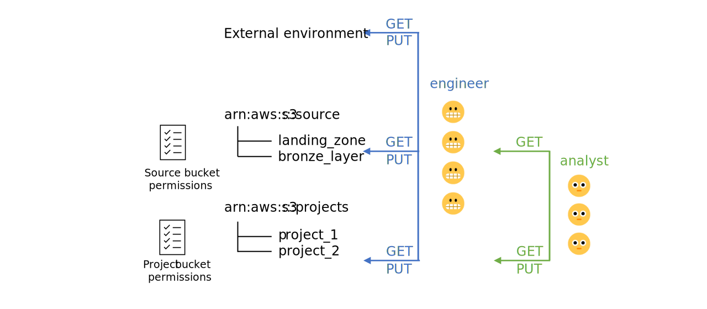

# Manage S3 bucket permissions  

Step 1: [Create S3 buckets and S3 bucket policies](#create-s3-buckets-and-s3-bucket-policies)    
Step 2: [Test S3 bucket policies](#test-s3-bucket-policies)   

# Change log   
<br>  

# Create S3 buckets and S3 bucket policies   
[Access to S3 resources](https://aws.amazon.com/blogs/security/iam-policies-and-bucket-policies-and-acls-oh-my-controlling-access-to-s3-resources/) can be controlled using multiple methods. In general, IAM policies allow or restrict S3 bucket resource permissions for user groups whereas S3 bucket policies are attached to specific S3 buckets and enable fine tuning of S3 bucket content permissions at the [principal](https://docs.aws.amazon.com/IAM/latest/UserGuide/reference_policies_elements_principal.html) i.e. individual user level.       

S3 bucket permissions can be set at the bucket, root level or folder level.  

In our case, we would like to create two S3 bucket resources, one named **source** and one named **projects**.    

+ The **source** bucket will contain a **landing_zone** folder and **bronze_layer** folder, with data analysts granted LIST access to both folders and GET access to the **bronze_layer** folder.   
+ The **projects** bucket will contain multiple folders, each hosting a separate project. Analysts have GET and PUT access to their own project folders.   

  

To create the **source** S3 bucket:    
1. Log into AWS using a data engineer user account and navigate to the S3 console and click ***Create bucket***.    
2. This takes you to a new page where you need to assign a unique bucket name i.e. **\<name>-source**, confirm your AWS region as **ap-southeast-2**, keep ACLs disabled under ***Object Ownership***, block all public access under ***Block Public Access settings for this bucket***, enable data object versioning under ***Bucket Versioning*** and enable server-side encryption using Amazon S3-managed keys under ***Default encryption***.    
3. Confirm bucket creation by clicking ***Create bucket*** again.  
4. Click on the newly created bucket and navigate to the ***Properties*** tab to locate its Amazon Resource Name (ARN) i.e. **arn:aws:s3:::<name>-source**.  
5. Navigate back to the ***Object*** tab and click ***Create folder*** to create the **landing_zone** and **bronze_layer** folders. Remember to enable server-side encryption using Amazon S3-managed keys.    
6. Navigate to the ***Permissions*** tab and scroll down to the [bucket policy](https://docs.aws.amazon.com/AmazonS3/latest/userguide/add-bucket-policy.html) section and click ***edit***. Note that only the bucket owner can associate a policy with the S3 bucket.   
7. Create the Source S3 bucket policy and input the following code into the JSON editor.     

    ```json   
    {
    "Version": "2012-10-17",
    "Statement": 
        [
            {
                "Sid": "RestrictLandingZoneAccess",
                "Effect": "Allow",  
                "Principal": {
                    "AWS": "arn:aws:iam::<aws-account-id>:user/analyst_<name>"
                },  
                "Action": [
                    "s3:GetObject",
                    "s3:GetObjectVersion",
                    "s3:GetObjectVersionAttributes",
                    "s3:GetObjectAttributes"
                    ],
                "Resource": [
                    "arn:aws:s3:::<name>-source/bronze_layer",
                    "arn:aws:s3:::<name>-source/bronze_layer/*"
                    ]
            }
        ]
    }
    ```     
    > **Note**  
    > Individual AWS user accounts have to be specified under `Principle` in the S3 bucket policy i.e. no wildcard user account names allowed. The **engineer** user group has access to all S3 resources by default via their IAM access policy and individual analysts are granted additional **\<name>-source/bronze_layer** GET object access.     

To create the **projects** S3 bucket:  
1. Remain logged into your data engineer user account and navigate to the S3 console and repeat steps 1 to 4 above i.e. create a new S3 bucket named **\<name>-projects** with the same bucket settings.
2. Navigate back to the ***Object*** tab and click ***Create folder*** to create the **palmer_penguins_analysis** and **nlp_classification** folders. Remember to enable server-side encryption using Amazon S3-managed keys.    
3. Navigate to the ***Permissions*** tab and scroll down to the [bucket policy](https://docs.aws.amazon.com/AmazonS3/latest/userguide/add-bucket-policy.html) section and click ***edit***. Note that only the bucket owner can associate a policy with the S3 bucket.   
4. Create the Projects S3 bucket policy and input the following code into the JSON editor. This policy only allows the user **analyst_<name>** to have GET, PUT and DELETE access to the **palmer_penguins_analysis** BUT NOT the **nlp_classification** folder.         
    
    ```json    
    {
    "Version": "2012-10-17",
    "Statement": 
        [
            {
                "Sid": "RestrictPalmerPenguinAnalysisAccess",
                "Effect": "Allow", 
                "Principal": {
                    "AWS": "arn:aws:iam::<aws-account-id>:user/analyst_<name>"
                },  
                "Action": [
                    "s3:GetObject",
                    "s3:GetObjectVersion", 
                    "s3:GetObjectVersionAttributes",
                    "s3:GetObjectAttributes",
                    "s3:PutObject"
                    ],
                "Resource": [
                    "arn:aws:s3:::<name>-projects/palmer_penguins_analysis",
                    "arn:aws:s3:::<name>-projects/palmer_penguins_analysis/*"
                    ]
            },

            {
                "Sid": "RestrictPalmerPenguinAnalysisSubfolderDeletion",
                "Effect": "Allow",  
                "Principal": {
                    "AWS": "arn:aws:iam::<aws-account-id>:user/analyst_<name>"
                },  
                "Action": "s3:DeleteObject", 
                "Resource": "arn:aws:s3:::<name>-projects/palmer_penguins_analysis/*"
            }
        ]
    }
    ```     
 When IAM and S3 bucket policies both exist for a user, access is determined as the least-privilege union of all the user permissions. Always avoid using `"Principal": "*"` with an `allow` effect in S3 bucket policies, as this will enable public access to your AWS resources. Also avoid setting up S3 bucket permissions using S3 ACLs as this is a legacy permissions maintenance system.      
</br> 

# Test S3 bucket policies    
To test S3 bucket policies, we need to ensure that:   

+ User **engineer-\<name>** has the ability to create and delete new buckets and new bucket folders, and write and read from the **<name>-source** and **<name>-projects** buckets and bucket folders.    
+ User **analyst-\<name>** only has the ability to read from the **<name>-source/bronze_layer** bucket folder, and read and write and delete objects inside the **<name>-projects/palmer_penguins_analysis** bucket folder.     

When using S3 bucket commands in Cloudshell, the `s3` commands provide higher level controls whilst the original `s3api` commands provide low-level granular controls.    

| Action | CLI code | Engineer | Analyst |    
| ------ | -------- | -------- | ------- |     
| Create new test bucket | `aws s3api create-bucket --bucket <name>-btest --region ap-southeast-2 --create-bucket-configuration LocationConstraint=ap-southeast-2` | :heavy_check_mark: | :x: |   
| Create new object in test bucket | `echo "hello world" \| aws s3 cp - s3://<name>-btest/test/hw_test.txt --sse AES256` | :heavy_check_mark: | :x: |    
| View test buckets | `aws s3api list-buckets` or `aws s3 ls` | :heavy_check_mark: | :heavy_check_mark: |    
| View test bucket contents | `aws s3 ls s3://<name>-source --recursive` | :heavy_check_mark: | :heavy_check_mark: |      
| Delete test bucket contents and bucket recursively | `aws s3 rb s3://<name>-btest --force` | :heavy_check_mark: | - |   
| Create new object in **\<name>-source/bronze_layer** bucket folder | `echo "hello world" \| aws s3 cp - s3://<name>-source/bronze_layer/hw_test.txt --sse AES256` | :heavy_check_mark: | :heavy_check_mark: |  
| Copy object from **\<name>-source/bronze_layer** to **\<name>-projects/palmer_penguins_analysis** bucket folder | `aws s3 cp s3://<name>-source/bronze_layer/hw_test.txt s3://<name>-projects/palmer_penguins_analysis/hw_test.txt --sse AES256` |  :heavy_check_mark: | :heavy_check_mark: |       
| Create new object in **\<name>-projects/nlp_classification** bucket folder | `echo "hello world" \| aws s3 cp - s3://<name>-projects/nlp_classification/hw_test.txt --sse AES256` | :heavy_check_mark: | :x: |   
| Delete object from **\<name>-projects/nlp_classification** bucket folder | `aws s3 rm s3://<name>-projects/nlp_classification/hw_test.txt` | :heavy_check_mark: | - |   
| Delete object from **\<name>-projects/palmer_penguins_analysis** bucket folder | `aws s3 rm s3://<name>-projects/palmer_penguins_analysis/hw_test.txt` | :heavy_check_mark: | :heavy_check_mark: |       

> **Note**   
> After deleting an S3 bucket, it can take a while for the bucket to be listed as deleted via `aws s3 ls` and `aws s3api list-buckets`.     

Congratulations, you have now set up and tested your S3 bucket access policies for **engineer** and **analyst** user groups.     